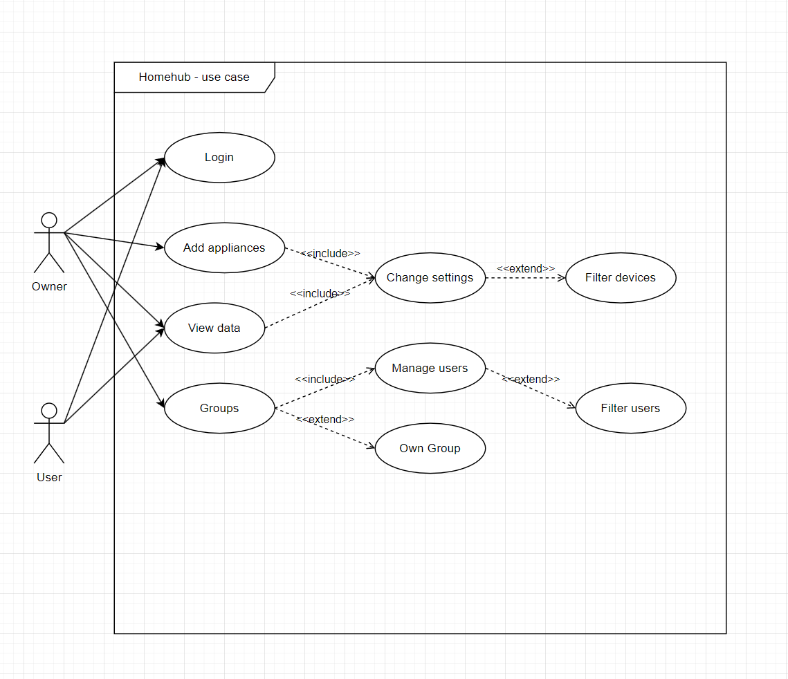
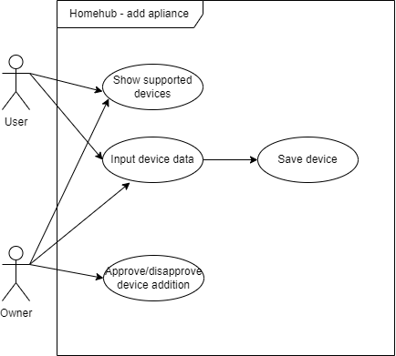
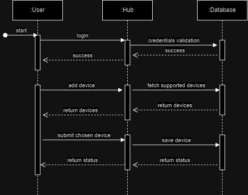
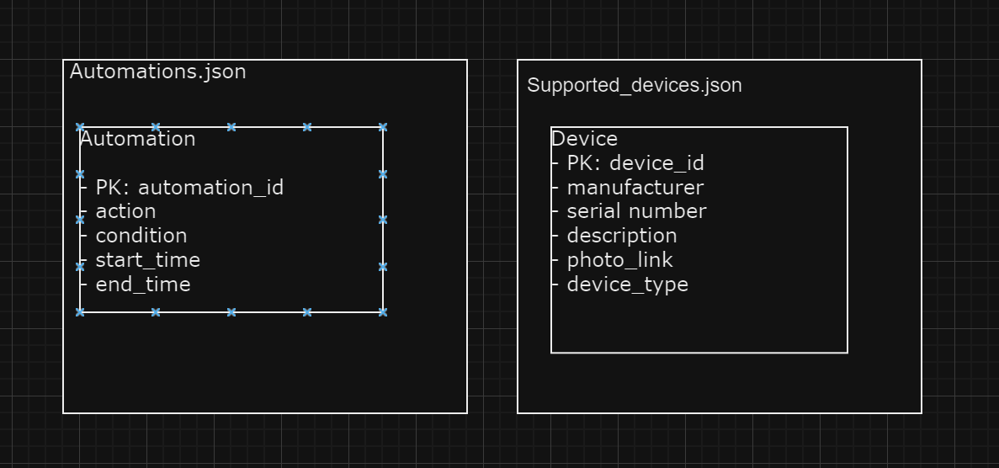
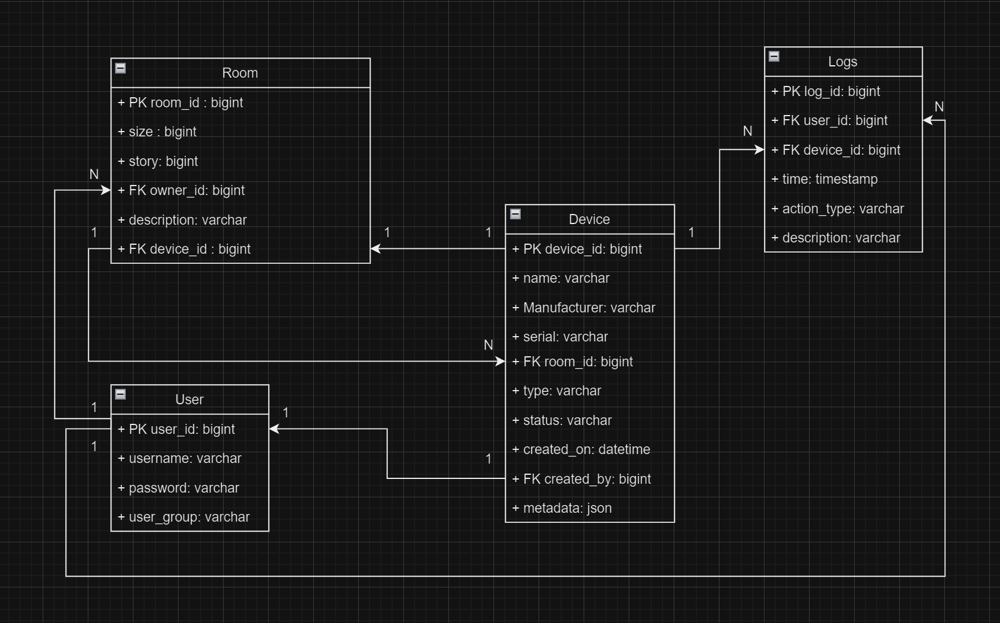
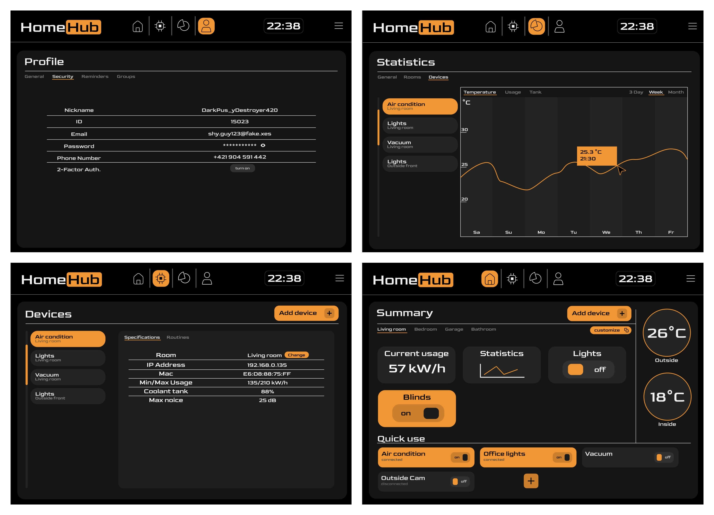

# Table of Contents

1.  [Funkčná špecifikácia](#orgbf1fc9e)
    1.  [Účel](#org7082754)
        1.  [Problémy, ktoré projekt rieši:](#org927197d)
2.  [Technická špecifikácia](#org33826e1)
    1.  [Architektúra systému](#org57bc1ce)
    2.  [Technologický stack](#orgbbf7be5)
        1.  [Backend](#org223e41b)
        2.  [Frontend](#org1c31e6c)
        3.  [Databáza](#orgd107693)
    3.  [Komunikačné protokoly](#orgd20d9f1)
        1.  [RESTful API](#org0c091ce)
        2.  [MQTT (Message Queuing Telemetry Transport)](#org4cb1378)
    4.  [Bezpečnostné opatrenia](#orgfb1f8a1)
        1.  [Šifrovanie](#orga55b323)
        2.  [Autentifikácia a autorizácia](#org63701b4)
    5.  [Scalability a výkonnostné požiadavky](#orgc700099)
3.  [Požiadavky na produkt](#org6e1b153)
    1.  [Všeobecné požiadavky](#org75b9212)
        1.  [Použiteľnosť](#org97b2393)
        2.  [Výkonnosť](#org38786a6)
        3.  [Bezpečnosť](#orgbfe42ba)
    2.  [Špecifické požiadavky](#org2379dde)
        1.  [Správa zariadení](#org03b5b12)
        2.  [Ovládanie zariadení](#org4c627e9)
        3.  [História akcií](#org8fc653b)
        4.  [Nastavenia užívateľa](#orgf17a2de)
4.  [Dokument o prípadoch použitia](#org379ff48)
    1.  [Prípad použitia: Pridanie nového zariadenia](#org2855961)
        1.  [Aktéri](#org730585c)
        2.  [Scenár](#org354ae85)
    2.  [Prípad použitia: Ovládanie zariadenia](#orgaf8b3f6)
        1.  [Aktéri](#orgbd0d96f)
        2.  [Scenár](#orgd5836fc)
        3.  [UML diagramy](#orge4e2199)
        4.  [Roadmapa](#roadmap)
5.  [Design-board](#design-board)

# Funkčná špecifikácia

## Účel

Projekt sa zameriava na riešenie vybraných problémov spojených s monitorovaním a analýzou dát z IoT zariadení v kontexte inteligentnej domácnosti. V súčasnej dobe, keď domácnosti začínajú byť čoraz viac digitalizované a automatizované, je kľúčové zabezpečiť efektívne, bezpečné a užívateľsky prívetivé spracovanie dát z rôznych zariadení.

### Problémy, ktoré projekt rieši:

-   ****Rôznorodosť zariadení:**** V inteligentnej domácnosti môžeme nájsť rôzne zariadenia od mnohých výrobcov (osvetlenie, termostaty, bezpečnostné kamery, reproduktory atď.). Integrácia týchto zariadení do jednotného systému je výzvou.

-   ****Real-time reakcie:**** Niektoré hlásiče, sú efektívnejšie keď interagujú s inými zariadeniami.

-   ****Bezpečnosť a súkromie:**** Domácnosti obsahujú veľa súkromných informácií. Ochrana týchto dát pred neoprávneným prístupom, útokmi alebo únikmi je kľúčová.

-   ****Optimalizácia spotreby energie:**** Správna analýza dát môže pomôcť optimalizovať spotrebu energie v domácnosti, čím sa šetrí nielen peňaženka užívateľa, ale aj životné prostredie.

-   ****Užívateľská prispôsobivosť:**** Každý má iné preferencie týkajúce sa nastavenia svojho domu. Systém by mal byť dostatočne flexibilný, aby mohol zohľadňovať individuálne požiadavky a preferencie užívateľa.

Cieľom projektu HomeHub je vytvoriť integrovaný systém, ktorý spojí rôzne IoT zariadenia v inteligentnej domácnosti do jednej platformy, zabezpečí ich efektívne spracovanie a analýzu a poskytne užívateľom jasné a zrozumiteľné informácie a nástroje pre ich domácnosť.

# Technická špecifikácia

## Architektúra systému

Systém je navrhnutý ako modulárna platforma s viacerými komponentami, ktoré spolu interagujú. Hlavné komponenty zahrňujú:

-   **Backendový server:** Zodpovedný za spracovanie dát, analýzu a komunikáciu s databázou.
-   **Frontend (užívateľské rozhranie):** Umožňuje užívateľom zobrazovať dáta, nastavovať preferencie a ovládať jednotlivé zariadenia.
-   **Databáza** Skladuje historické dáta, užívateľské nastavenia a informácie o zariadeniach.
-   **Užívateľské zariadenia:** Užívateľ pripojí vlastné zariadenia

## Technologický stack

### Backend

-   **Jazyk a framework:** Python s frameworkom Flask pre vytvorenie API.
-   **Dátové spracovanie:** PySpark pre analýzu veľkých dát.

### Frontend

-   **Technológia:** ReactJS alebo Angular pre vytvorenie dyn amického webového rozhrania.

### Databáza

-   **TinyDB:** Vhodná pre ukladanie menších súborov, ktoré reprezentujú užívateľské zariadenia.
-   **MongoDB** Pre ukladanie dymanických dát

## Komunikačné protokoly

### RESTful API

Vytvorené pomocou Flasku na komunikáciu medzi frontendom a backendom, ako aj pre zber dát z IoT zariadení.

### MQTT (Message Queuing Telemetry Transport)

Lahký a efektívny protokol na komunikáciu s IoT zariadeniami v reálnom čase.

## Bezpečnostné opatrenia

### Šifrovanie

Všetky dáta prenášané medzi serverom a frontendom sú šifrované pomocou TLS.
Zariadenia v rámci domácnosti sú neštandardné a preto je bezpečnosť obmedzená na rámec lokálnej siete.

### Autentifikácia a autorizácia

Užívatelia musia byť autentifikovaní (napr. meno-heslo, kryptografický kľúč alebo pomocou OAuth2).

## Scalability a výkonnostné požiadavky

Systém bude podporovať jeden smer škálovania. Hlavým objektom je "domov", ktorý spravuje aj backend, aj front end. 

# Požiadavky na produkt

## Všeobecné požiadavky

### Použiteľnosť

-   Intuitívne užívateľské rozhranie ako webová stránka.
-   Jednoduchá registrácia a prihlásenie užívateľa do systému.
-   Priamočiara prvotná inštalácia systému 

### Výkonnosť

-   Systém by mal reagovať na užívateľské akcie v reálnom čase (latencia nižšia ako 2 sekundy) s overením výsledku.

### Bezpečnosť

-   Zabezpečenie dát pred neoprávneným prístupom.
-   Hash hesiel v databáze, salt, pepper.

## Špecifické požiadavky

### Správa zariadení

-   Užívatelia by mali byť schopní pridať nové IoT zariadenie (napr. inteligentnú žiarovku) do systému pomocou jednoduchého formulára.
-   Možnosť pre užívateľa prezrieť si zoznam pridaných zariadení.
-   Možnosť pre užívateľa mazať alebo upravovať informácie o pridaných zariadeniach.
-   Sledovať históriu zariadení (hodnôt, interakcií)

### Ovládanie zariadení

-   Možnosť zapnúť/vypnúť zariadenia cez užívateľské rozhranie.
-   Možnosť nastaviť automatizácie pre dom.
-   Časované a podmienené akcie v systéme.
-   Zobrazenie aktuálneho stavu zariadenia (zapnuté/vypnuté).

### História akcií

-   Systém by mal evidovať a zobrazovať históriu akcií užívateľov a hookov.

### Nastavenia užívateľa

-   Možnosť zmeny hesla, kľúča.
-   Možnosť nastavenia preferovaného jazyka rozhrania (napr. slovenčina, angličtina).

# Dokument o prípadoch použitia

## Prípad použitia: Pridanie nového zariadenia

### Aktéri

-   Užívateľ
-   Systém

### Scenár

1.  Užívateľ sa prihlási do systému.
2.  Užívateľ prejde do sekcie pre pridanie nového zariadenia.
3.  Užívateľ vyplní potrebné informácie o zariadení (napr. typ, názov, umiestnenie).
4.  Užívateľ potvrdí pridanie zariadenia.
5.  Systém uloží informácie a potvrdí užívateľovi úspešné pridanie.

## Prípad použitia: Ovládanie zariadenia

### Aktéri

-   Užívateľ
-   Systém
-   IoT zariadenie (inteligentná žiarovka)

### Scenár

1.  Užívateľ si prezrie zoznam dostupných zariadení.
2.  Užívateľ vyberie konkrétne zariadenie na ovládanie.
3.  Užívateľ stlačí tlačidlo pre zapnutie/vypnutie žiarovky.
4.  Systém pošle príkaz zariadeniu a aktualizuje stav v databáze.
5.  Užívateľ vidí aktualizovaný stav zariadenia v rozhraní.

### UML diagramy

**Use-Case diagram** 

Use case diagramy popisujúce základné interakcie so systémom

**Sekvenčný diagram**

Sekvenčný diagram popisujúci situáciu pridania nového smart zariadenia do domu.

**Databázový diagrem**

Diagram pre TinyDb zahŕňajúci supported_devices.json súbor, ktorý bude obsahovať zoznam podporovaných inteligentných zariadení
pre HomeHub aplikáciu. Automations.json obsahuje uložené automatizácie pre smart home.

Databázový diagram dynamickej časti databázy je centorvaný okolo tabuľky room, a obsahuje zariadenia, používateľov a logovací systém.

### Roadmap

Link : https://github.com/users/Tezim/projects/2

# Design board

